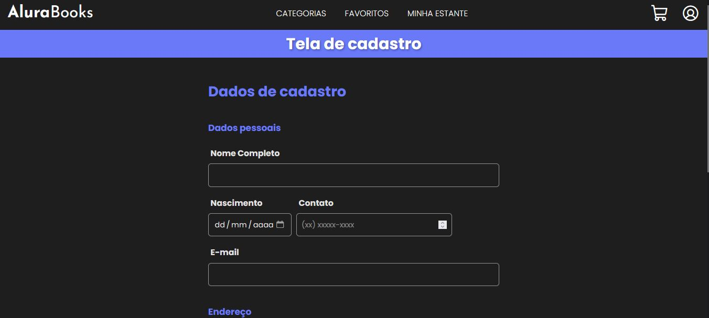

  Consulta Cep
  

>Status: ainda não responsivo

## Sobre o projeto
O projeto de Consulta Cep foi um projeto desenvolvido durante o curso de treinamento de Consumo e Tratamentos de dados de uma API, da [Alura](https://www.alura.com.br/). 
A função principal dele é, assim que o usuário digitar seu CEP, fazer uma requesição para a API [ViaCep](https://viacep.com.br/). A partir da resposta da requesição, alguns campos de informações(como rua, bairro, cidade e estado) são preenchidos automaticamente a partir dos dados retornados pela requesição à API, evitando assim possíveis erros do usuário ao preencher os campos.

## Principais conceitos
Os principais conceitos aprendidos ao longo do curso foram os de:

- JavaScript Síncrono e Assíncrono;
- Identificar como funciona o fluxo de eventos no JavaScript;
- Compreender como consumir uma API utilizando Fetch, Promises e métodos das Promises(como o then e o catch);
- Utilizar o Async/Await como uma alternativa no tratamento das Promises;
- Tratar dados retornados de uma API;
- Manipular elementos através de interação com o usuário.

Aprender cada um desses tópicos e alguns outros mais ao longo do curso foi uma experiência sensacional para mim.

## Tecnologias

- HTML
- CSS
- JavaScript
- Git
- GitHub

## Layout
O layout desse projeto foi inspirado no layout original do projeto do curso, porém, resolvi deixá-lo com algumas mudanças, como as cores de fundo e dos texto.
Você pode acessar o projeto [neste link]().